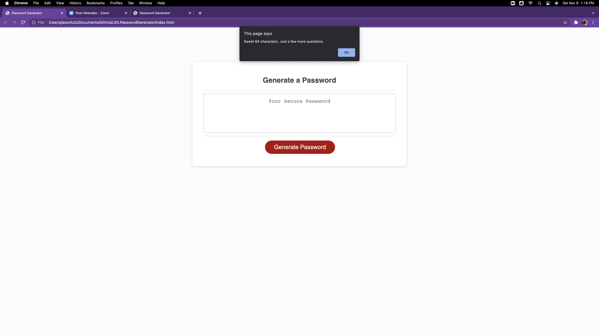

# JDLPasswordGenerator
Unit 3: Java Homework Assignment. Generates a passcode based on user requirements

Use: This application generates a password contingent on variables the user selects via prompts. 

This app can be viewed at:
https://lutzjason92.github.io/JDLPasswordGenerator/

Repository Link:
https://github.com/LutzJason92/JDLPasswordGenerator

Screen shot of application:

